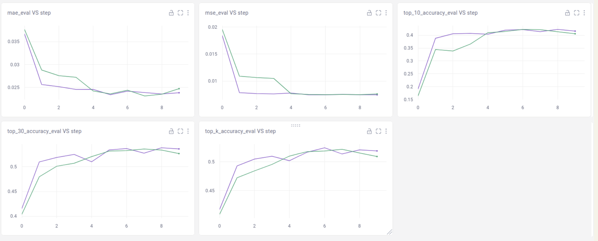
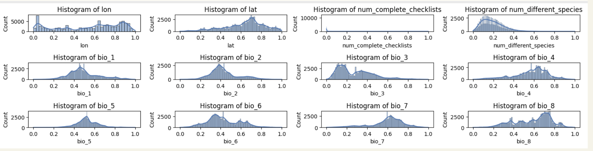

# bird-species-distribution-modeling-with-location-information

Welcome to the repository for our Fall AI Studio Challenge project! This work explores predictive modeling of bird species distributions in the USA using remote sensing, environmental data, and location encoding techniques. Below, you'll find a detailed overview of our objectives, methodology, and key results, along with resources to replicate our work.

---

## Project Overview
The aim of this project was to develop a scalable multi-label regression model to predict bird species encounter rates at eBird hotspots across the USA during summer. Leveraging the SatBird-USA-summer dataset, we combined environmental and spatial data to build a predictive model that outperformed baseline approaches.

---

## Objectives and Goals
- **Build a multi-label regression model** to predict encounter rates for 670 bird species.
- **Integrate environmental and location features** for improved predictive accuracy.
- **Evaluate model performance** using metrics like MSE, MAE, and Top-k accuracy.
- **Enhance baseline models** through data augmentation and normalization techniques.

---

## Methodology
### Data Sources
- **eBird:** Citizen science bird checklist data.
- **Sentinel-2:** Satellite reflectance data.
- **SoilGrids & WorldClim:** Bioclimatic and pedological data.
- **US Census Bureau:** Shapefiles for geographical boundaries.

### Data Preparation
1. **Normalization:** Standardized numeric features using transformations like Box-Cox or Yeo-Johnson.
2. **Augmentation:** Added random Gaussian noise to environmental features to simulate real-world variability.

### Model Architecture
Our model was a **Multi-Layer Perceptron (MLP)** with:
- Input layer for linear transformations.
- Two hidden layers with Leaky ReLU activations.
- A final Sigmoid activation for multi-label regression.

**Training Function:** Binary Cross Entropy as the loss function.

### Baseline Models
1. **Baseline 1:** Environmental features only (no augmentation or normalization).
2. **Baseline 2:** Environmental features with augmentation and normalization.
3. **Baseline 3:** Environmental + location features with augmentation and normalization.

---

## Results and Key Findings
| Metric           | Baseline 1        | Baseline 2        | Baseline 3        |
|------------------|-------------------|-------------------|-------------------|
| **MSE**          | 0.00777           | 0.007559          | 0.007746          |
| **MAE**          | 0.02491           | 0.02426           | 0.02472           |
| **Top-10**       | 0.4053            | 0.4177            | **0.4189**        |
| **Top-30**       | 0.5185            | **0.5328**        | 0.5225            |
| **Top-k**        | 0.5082            | 0.5178            | 0.511             |

- **Improvement:** Baseline 2 showed the most consistent improvements with augmentation and normalization, while Baseline 3 integrated location features effectively for Top-10 accuracy.

---

## Visualizations
### Model (Baseline 3) Results


### Data Distribution


---

## Potential Next Steps
1. **Optimize Location Encoding:** Enhance the integration of spatial and environmental features.
2. **Explore Advanced Techniques:** Incorporate ensemble models and optimization algorithms.
3. **Expand Dataset:** Extend to other seasons or regions for broader applicability.
4. **Automate Preprocessing:** Build a robust pipeline for normalization and augmentation.

---

## Getting Started
### Installation
1. Clone the repository:
   ```bash
   git clone https://github.com/DanielleRaine/Bird-Species-Distribution-Modeling-with-Location-Information.git
   cd Bird-Species-Distribution-Modeling-with-Location-Information
   ```
2. Install dependencies:
   ```bash
   pip install -r requirements.txt
   ```


### Sample Dataset
- Access a subset of the SatBird-USA-summer dataset for testing purposes in the `data/` folder.
---

## Documentation
Complete documentation, including API details, is available in the `docs/` folder. Key sections include:
- **User Guide:** Step-by-step instructions for data preparation, training, and evaluation.
- **API Reference:** Functions and modules used in the project.

---

## Acknowledgments
Special thanks to our advisor Hager Radi, TA Jesse Ward, and the BTT program staff for their support. The project template was created using **Slidesgo**, **Flaticon**, and **Freepik** resources.

---

## Repository Links
- Project Repository: [Bird Species Distribution Modeling with Location Information](https://github.com/brielle-young/bird-species-distribution-modeling-with-location-information)
- Data Source: [SatBird Dataset](https://satbird.github.io)

---

For further inquiries, contact us:
- **Danielle Raine:** dih220001@utdallas.edu
- **Brielle Young:** bgy5@cornell.edu
- **Frantzia Theodat:** frantziatheodat@gmail.com
- **Connie Deng:** conniedeng303@gmail.com


